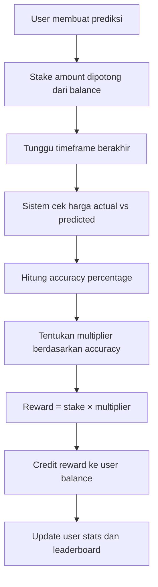
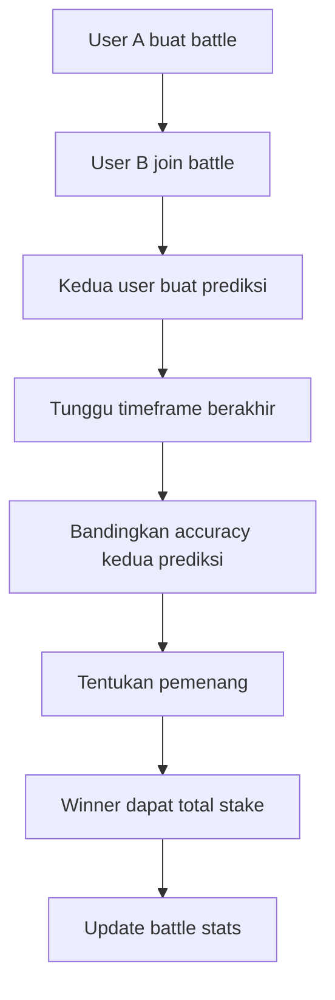
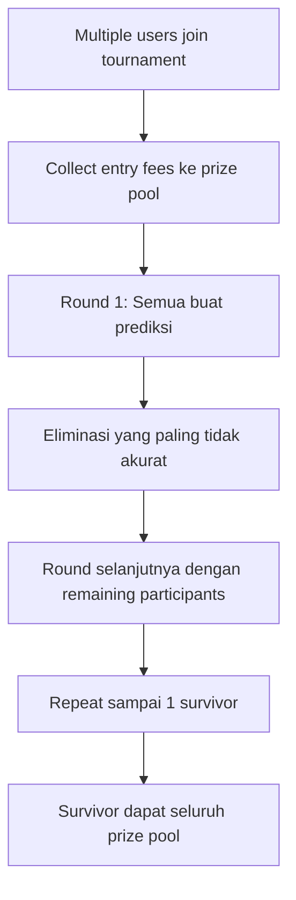

# Struktur Aplikasi Nectiq - Fitur dan Mekanisme Reward

## Overview Sistem

Nectiq adalah platform prediksi cryptocurrency yang menggabungkan gamifikasi dengan sistem reward yang komprehensif. Platform ini memiliki arsitektur modular dengan berbagai fitur gaming dan sistem reward yang terintegrasi.

## Struktur Fitur Utama

### 1. Sistem Prediksi Cryptocurrency

**Lokasi File**: 
- Frontend: `client/src/components/prediction-form.tsx`
- Backend: `server/routes.ts` (endpoints `/api/predictions/*`)
- Database: `shared/schema.ts` (tabel `predictions`)

**Mekanisme**:
```typescript
// Cara kerja prediksi
1. User memilih cryptocurrency (Bitcoin, Ethereum, dll)
2. User memasukkan target harga prediksi
3. User memilih timeframe (1 jam, 6 jam, 24 jam, 7 hari)
4. User memasukkan stake amount (50-500 PTS)
5. Sistem menghitung akurasi setelah timeframe berakhir
6. Reward diberikan berdasarkan tingkat akurasi
```

**Sistem Reward Prediksi**:
- **Perfect Prediction (±0.1%)**: 5x multiplier
- **Excellent (±0.5%)**: 3x multiplier  
- **Good (±1.0%)**: 2x multiplier
- **Fair (±2.0%)**: 1.5x multiplier
- **Poor (>2.0%)**: 0.5x multiplier

### 2. Battle System (Prediction Battles)

**Lokasi File**:
- Frontend: `client/src/components/prediction-battles.tsx`
- Backend: `server/routes.ts` (endpoints `/api/battles/*`)
- Database: `shared/schema.ts` (tabel `battles`)

**Mekanisme**:
```typescript
// Cara kerja battle
1. User A membuat battle dengan stake amount
2. User B join battle dengan stake amount sama
3. Keduanya membuat prediksi untuk cryptocurrency yang sama
4. Setelah timeframe berakhir, yang lebih akurat menang
5. Pemenang mendapat total stake dari kedua user
```

**Battle Reward System**:
- **Winner**: Mendapat 100% dari total stake (stake sendiri + stake lawan)
- **Loser**: Kehilangan stake amount
- **Draw**: Masing-masing mendapat kembali stake sendiri

### 3. Survival Tournament System

**Lokasi File**:
- Frontend: `client/src/components/survival-game.tsx`
- Backend: `server/services/survivalRoundService.ts`
- Database: `shared/schema.ts` (tabel `survival_tournaments`, `survival_participants`)

**Mekanisme**:
```typescript
// Cara kerja survival tournament
1. Multiple users join tournament dengan entry fee
2. Setiap round, semua participant buat prediksi
3. Yang prediksinya paling tidak akurat tereliminasi
4. Tournament berlanjut sampai tersisa 1 pemenang
5. Pemenang mendapat prize pool total
```

**Survival Tournament Rewards**:
- **Winner**: 100% dari total prize pool
- **Entry Fee**: Biasanya 50-100 NTIQ per participant
- **Prize Pool**: Total dari semua entry fees

### 4. Sistem Poin dan Balance

**Lokasi File**:
- Backend: `server/services/balanceService.ts`
- Database: `shared/schema.ts` (tabel `users`, `transaction_logs`)

**Token Ekonomi**:
- **NTIQ**: Token utama platform
- **PTS**: Points untuk staking predictions

**Cara Mendapat NTIQ**:
1. **Deposit**: Convert ETH/USDC/USDT → NTIQ
2. **Prediction Rewards**: Berdasarkan akurasi prediksi
3. **Battle Wins**: Menang battle melawan user lain
4. **Survival Tournament**: Menjadi last survivor
5. **Daily Challenges**: Menyelesaikan challenge harian
6. **Referral Rewards**: Mengundang user baru

## Sistem Reward Komprehensif

### 1. Calculation Engine

**Lokasi**: `server/routes.ts` (endpoint `/api/predictions/:id/result`)

```typescript
// Formula perhitungan reward
const accuracy = Math.abs((targetPrice - actualPrice) / actualPrice * 100);
let multiplier = 0.5; // Default poor prediction

if (accuracy <= 0.1) multiplier = 5.0;      // Perfect
else if (accuracy <= 0.5) multiplier = 3.0;  // Excellent  
else if (accuracy <= 1.0) multiplier = 2.0;  // Good
else if (accuracy <= 2.0) multiplier = 1.5;  // Fair

const reward = stakeAmount * multiplier;
```

### 2. Leaderboard System

**Lokasi File**:
- Frontend: `client/src/pages/leaderboard.tsx`
- Backend: `server/storage.ts` (method `getEnhancedLeaderboard`)

**Ranking Berdasarkan**:
- Total Rewards (NTIQ yang diperoleh)
- Accuracy Rate (persentase prediksi akurat)
- Total Predictions (jumlah prediksi dibuat)
- Battle Wins (kemenangan battle)
- Survival Tournament victories

### 3. Achievement System

**Lokasi File**:
- Frontend: `client/src/components/achievements.tsx`
- Backend: `server/routes.ts` (endpoints `/api/achievements/*`)

**Jenis Achievements**:
- **Accuracy Master**: 90%+ accuracy rate
- **High Roller**: Stake 500 PTS dalam satu prediksi
- **Battle Champion**: Menang 10 battles berturut-turut
- **Survivor**: Menang survival tournament
- **Prophet**: Perfect prediction (±0.1%)

## Data Flow Reward System

### 1. Prediction Reward Flow



### 2. Battle Reward Flow



### 3. Survival Tournament Flow



## Database Schema Reward

### Tabel Users
```sql
users {
  id: integer
  walletAddress: string
  username: string
  balance: decimal        -- NTIQ balance
  totalRewards: decimal   -- Total rewards earned
  accuracyRate: decimal   -- Overall accuracy %
  totalPredictions: integer
  winStreak: integer
  createdAt: timestamp
}
```

### Tabel Transaction Logs
```sql
transaction_logs {
  id: integer
  userId: integer
  type: string           -- 'prediction_reward', 'battle_win', 'survival_win'
  amount: decimal        -- NTIQ amount
  description: string
  hash: string          -- Transaction hash (jika ada)
  createdAt: timestamp
}
```

### Tabel Predictions
```sql
predictions {
  id: integer
  userId: integer
  cryptoId: string
  targetPrice: decimal
  actualPrice: decimal
  timeframe: string
  stakeAmount: decimal
  accuracy: decimal
  multiplier: decimal
  reward: decimal
  status: string         -- 'pending', 'completed', 'failed'
  createdAt: timestamp
  resolvedAt: timestamp
}
```

## API Endpoints Reward

### Prediction Endpoints
```typescript
GET  /api/predictions/user/:userId     // User's predictions
POST /api/predictions                  // Create new prediction
GET  /api/predictions/:id/result       // Get prediction result
POST /api/predictions/:id/resolve      // Resolve prediction (admin)
```

### Battle Endpoints
```typescript
GET  /api/battles                      // List active battles
POST /api/battles                      // Create new battle
POST /api/battles/:id/join            // Join existing battle
GET  /api/battles/user/:userId        // User's battles
```

### Survival Tournament Endpoints
```typescript
GET  /api/survival/tournaments         // List tournaments
POST /api/survival/join/:tournamentId  // Join tournament
GET  /api/survival/user/:userId        // User's tournament history
```

### Reward & Balance Endpoints
```typescript
GET  /api/users/:id/balance           // User balance
GET  /api/users/:id/transactions      // Transaction history
GET  /api/users/:id/rewards           // Reward summary
GET  /api/leaderboard                 // Platform leaderboard
```

## Real-Time Updates

### WebSocket Integration
**Lokasi**: `server/routes.ts` (WebSocket setup)

**Real-time Features**:
- Live price updates (setiap detik)
- Battle status updates
- Tournament progress
- Balance updates
- Leaderboard changes

## Admin Panel Oversight

### Reward Management
**Lokasi**: `client/src/pages/admin.tsx`

**Admin Capabilities**:
- Monitor all transactions
- Manually resolve stuck predictions
- Adjust reward multipliers
- Manage tournaments
- View user statistics
- Export reward data

## Security dan Anti-Gaming

### Reward Security
**Lokasi**: `server/antiGamingUtils.ts`

**Protections**:
- Minimum stake amounts
- Maximum stake limits
- Rate limiting on predictions
- IP-based monitoring
- Wallet address verification
- Admin manual review for large rewards

## Mobile Responsiveness

Semua fitur reward dan gaming fully responsive untuk mobile:
- Touch-friendly interfaces
- Optimized layouts untuk small screens
- Real-time updates work di mobile
- Push notifications untuk reward updates

---

**Struktur ini memberikan gambaran lengkap tentang bagaimana sistem reward terintegrasi di seluruh platform Nectiq, dari prediksi individual hingga tournament multiplayer dengan prize pools besar.**