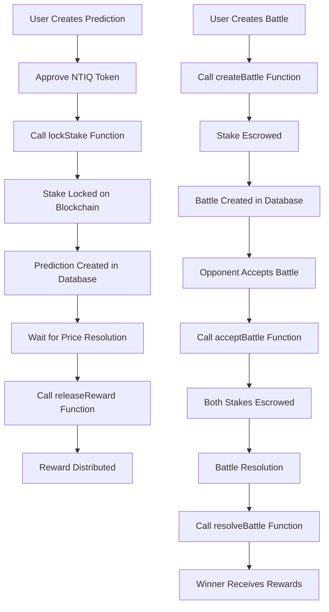

# 🔗 Smart Contracts Documentation

NECTIQ uses a comprehensive suite of smart contracts deployed on **Polygon Amoy Testnet** to ensure transparency, security, and decentralization. All contracts are **blockchain-first**, meaning predictions, battles, and parlays are only created after successful blockchain transaction confirmation.

> 🚧 **Current Status:** The application is **temporarily limited to Polygon Amoy Testnet only**. All smart contracts, predictions, battles, and parlays are currently deployed and functional only on Polygon Amoy Testnet for development and testing purposes.

> ⚠️ **Important:** This is a **testnet deployment** for development and testing. Real funds should not be used. The platform will migrate to mainnet in future development phases.

## 📍 Contract Addresses (Polygon Amoy Testnet)

| Contract | Address | Purpose |
|----------|---------|---------|
| **NTIQ Token** | `0xE276c3634b7747c46c1aBAB4Eff6b2f046C71A6f` | Native platform token |
| **Enhanced Prediction Staking** | `0xcf62251Aa622519A1E83BE270CDfE78C073F9fd3` | Prediction staking & rewards |
| **Enhanced Parlay Staking** | `0x87D08a494D960240d3a2D5CdB155084CAF222584` | Parlay/TrendRide staking |
| **Battle Escrow** | `0x65CBABb0864de26fc753F5044277644f72Df8490` | Battle staking & resolution |
| **Multi-Token Vault** | `0xe124893F7E1d5bF82586680c590f9510b6dCf42e` | Multi-chain token management |
| **Prediction Insurance** | `0x170aF9d61945c6AbD8619d6cafbd03E5fC8ae3Ce` | Insurance for failed predictions |
| **Referral System** | `0x7E9F85CDDb70A0d3Ab7738B61610d1774867c8e2` | Referral tracking & rewards |
| **NFT Achievement System** | `0x57c5aE2C1ed8ef90e264D165b5A7F7C750C50C3f` | Achievement NFTs |

## 🪙 Supported Tokens (Polygon Amoy)

| Token | Address | Decimals | Purpose |
|-------|---------|----------|---------|
| **WETH** | `0x7ceB23fD6bC0adD59E62ac25578270cFf1b9f619` | 18 | Wrapped Ethereum |
| **USDC** | `0x2791Bca1f2de4661ED88A30C99A7a9449Aa84174` | 6 | USD Coin |
| **LINK** | `0x53E0bca35eC356BD5ddDFebbD1Fc0fD03FaBad39` | 18 | Chainlink Token |

## 🔧 Smart Contract Functions

### 1. **Enhanced Prediction Staking Contract**

**Purpose:** Handles prediction staking and reward distribution with blockchain-first approach.

**Key Functions:**
```solidity
// Lock stake for prediction
function lockStake(
    bytes32 predictionId,
    uint256 amount,
    uint256 duration,
    uint256 predictedPrice
) external returns (bool);

// Release reward after prediction resolution
function releaseReward(
    bytes32 predictionId,
    uint256 actualPrice
) external returns (bool);
```

**Features:**
- ✅ **Blockchain-First:** Predictions only created after successful stake lock
- ✅ **Automatic Rewards:** Rewards released based on prediction accuracy
- ✅ **Transparent:** All transactions verifiable on blockchain
- ✅ **Secure:** Stake locked until prediction resolution

### 2. **Enhanced Parlay Staking Contract**

**Purpose:** Manages TrendRide/Parlay predictions with compound staking and rewards.

**Key Functions:**
```solidity
// Lock stake for parlay prediction
function lockParlayStake(
    bytes32 parlayId,
    uint256 amount,
    uint8 coinCount,
    uint256 duration
) external returns (bool);

// Release compound reward for winning parlay
function releaseCompoundReward(
    bytes32 parlayId
) external returns (bool);
```

**Features:**
- ✅ **Compound Staking:** Multiple predictions in single transaction
- ✅ **Higher Multipliers:** Increased rewards for successful parlays
- ✅ **All-or-Nothing:** All predictions must win to claim rewards
- ✅ **Blockchain Verification:** Every parlay verified on-chain

### 3. **Battle Escrow Contract**

**Purpose:** Manages head-to-head prediction battles with escrow functionality.

**Key Functions:**
```solidity
// Create new battle
function createBattle(
    bytes32 battleId,
    uint256 stakeAmount
) external returns (bool);

// Accept battle challenge
function acceptBattle(
    bytes32 battleId
) external returns (bool);

// Resolve battle and distribute rewards
function resolveBattle(
    bytes32 battleId,
    address winner
) external returns (bool);
```

**Features:**
- ✅ **Escrow System:** Stakes locked until battle resolution
- ✅ **Winner Takes All:** Winner receives both stakes (minus platform fee)
- ✅ **Fair Resolution:** Automated winner determination
- ✅ **Transparent:** All battle data on blockchain

### 4. **Multi-Token Vault Contract**

**Purpose:** Manages multi-chain token deposits and withdrawals with signature-based security.

**Key Functions:**
```solidity
// Deposit POL (native token)
function depositPOL() external payable;

// Deposit ERC20 tokens
function depositToken(
    address token,
    uint256 amount
) external;

// Request withdrawal with signature
function requestWithdrawal(
    address token,
    uint256 amount,
    bytes signature
) external;

// Get user balance for specific token
function getUserBalance(
    address user,
    address token
) external view returns (uint256);
```

**Features:**
- ✅ **Multi-Token Support:** POL, WETH, USDC, LINK, NTIQ
- ✅ **Signature Security:** Withdrawals require backend signature
- ✅ **Automated Processing:** Backend monitors and processes withdrawals
- ✅ **Real-time Balances:** Live balance updates from blockchain

### 5. **Prediction Insurance Contract**

**Purpose:** Provides insurance for failed predictions to reduce user risk.

**Key Functions:**
```solidity
// Buy insurance for prediction
function buyInsurance(
    bytes32 predictionId,
    uint256 stakeAmount
) external returns (bool);

// Claim insurance refund
function claimInsurance(
    bytes32 predictionId
) external returns (bool);

// Get insurance details
function getInsuranceClaim(
    bytes32 predictionId
) external view returns (
    address user,
    uint256 stakeAmount,
    uint256 insuranceCost,
    uint256 refundAmount,
    bool claimed,
    uint256 timestamp
);
```

**Features:**
- ✅ **Risk Mitigation:** Partial refund for failed predictions
- ✅ **Optional Coverage:** Users can choose to buy insurance
- ✅ **Transparent Claims:** All insurance data on blockchain
- ✅ **Fair Pricing:** Insurance cost based on prediction risk

### 6. **Referral System Contract**

**Purpose:** Tracks referrals and distributes referral rewards on-chain.

**Key Functions:**
```solidity
// Register referral relationship
function registerReferral(
    address referrer,
    address referee
) external returns (bool);

// Get referral data for user
function getReferralData(
    address referee
) external view returns (
    address referrer,
    uint256 totalEarnings,
    uint256 totalActivities,
    bool active
);

// Get total referral earnings
function getUserTotalReferralEarnings(
    address referrer
) external view returns (uint256);
```

**Features:**
- ✅ **On-Chain Tracking:** All referrals recorded on blockchain
- ✅ **Automatic Rewards:** Referral rewards distributed automatically
- ✅ **Transparent:** Referral relationships publicly verifiable
- ✅ **Sustainable:** Rewards based on referred user activity

### 7. **NFT Achievement System Contract**

**Purpose:** Manages achievement NFTs and tracks user progress on-chain.

**Key Functions:**
```solidity
// Get achievement details
function getAchievement(
    uint256 achievementId
) external view returns (
    uint256 id,
    string category,
    string name,
    string description,
    uint256 threshold,
    bool isMintable
);

// Get user progress for category
function getUserProgress(
    address user,
    string category
) external view returns (uint256);

// Check if user has minted achievement
function checkUserHasMinted(
    address user,
    uint256 achievementId
) external view returns (bool);

// Standard ERC721 functions
function balanceOf(address owner) external view returns (uint256);
function tokenOfOwnerByIndex(address owner, uint256 index) external view returns (uint256);
```

**Features:**
- ✅ **ERC721 Standard:** Compatible with all NFT marketplaces
- ✅ **Progress Tracking:** User progress tracked on-chain
- ✅ **Achievement Categories:** Multiple achievement types
- ✅ **Mintable NFTs:** Users can mint achievement NFTs

## 🔒 Security Features

### Blockchain-First Architecture
- **No Off-Chain Predictions:** All predictions require blockchain transaction
- **Transparent Operations:** Every action verifiable on blockchain
- **Immutable Records:** Prediction history cannot be altered
- **Decentralized Verification:** No single point of failure

### Smart Contract Security
- **OpenZeppelin Standards:** Using battle-tested security libraries
- **Access Control:** Role-based permissions for admin functions
- **Reentrancy Protection:** Protection against reentrancy attacks
- **Pausable Contracts:** Emergency pause functionality

### Multi-Signature Security
- **Admin Multi-Sig:** Critical functions require multiple signatures
- **Timelock Delays:** Important changes have delay periods
- **Governance Integration:** Community can vote on protocol changes

## 🌐 Network Configuration

**Primary Network:** Polygon Amoy Testnet (Testnet Only)
- **Chain ID:** 80002
- **RPC URL:** `https://rpc-amoy.polygon.technology`
- **Explorer:** `https://amoy.polygonscan.com`
- **Native Token:** MATIC (Testnet)

> 🚧 **Current Limitation:** The application is **temporarily limited to Polygon Amoy Testnet only**. All smart contracts and main functionality are deployed only on this testnet for development and testing purposes.

**Supported Networks for Deposits Only:**
- Ethereum (Mainnet & Sepolia) - Deposit functionality only
- Base (Mainnet) - Deposit functionality only
- BSC (Mainnet) - Deposit functionality only
- Optimism (Mainnet) - Deposit functionality only
- Arbitrum (Mainnet) - Deposit functionality only
- Polygon (Amoy Testnet) - Full functionality (smart contracts, predictions, battles, parlays)

> ⚠️ **Important:** While deposits are supported from multiple networks, all smart contract interactions (predictions, battles, parlays) are currently limited to Polygon Amoy Testnet only.

## 📊 Contract Interaction Flow



## 🔧 Environment Variables

### Smart Contract Configuration

> 🚧 **Network Limitation:** All contract addresses below are for **Polygon Amoy Testnet only**. The application currently does not support mainnet deployment.

| Variable | Description | Required | Default |
|----------|-------------|----------|---------|
| `ENHANCED_PREDICTION_STAKING_ADDRESS` | Enhanced Prediction Staking contract address (Polygon Amoy Testnet) | Yes | - |
| `ENHANCED_PARLAY_STAKING_ADDRESS` | Enhanced Parlay Staking contract address (Polygon Amoy Testnet) | Yes | - |
| `BATTLE_ESCROW_ADDRESS` | Battle Escrow contract address (Polygon Amoy Testnet) | Yes | - |
| `MULTI_TOKEN_VAULT_ADDRESS` | Multi-Token Vault contract address (Polygon Amoy Testnet) | Yes | - |
| `PREDICTION_INSURANCE_ADDRESS` | Prediction Insurance contract address (Polygon Amoy Testnet) | Yes | - |
| `REFERRAL_SYSTEM_ADDRESS` | Referral System contract address (Polygon Amoy Testnet) | Yes | - |
| `NFT_ACHIEVEMENT_SYSTEM_ADDRESS` | NFT Achievement System contract address (Polygon Amoy Testnet) | Yes | - |
| `BACKEND_SIGNER_PRIVATE_KEY` | Backend signer private key for contract interactions | Yes | - |

### Example .env Configuration

> ⚠️ **Testnet Only:** The configuration below is for **Polygon Amoy Testnet only**. These are testnet contract addresses and should not be used with real funds.

```bash
# Smart Contract Addresses (Polygon Amoy Testnet - Testnet Only)
ENHANCED_PREDICTION_STAKING_ADDRESS=0xcf62251Aa622519A1E83BE270CDfE78C073F9fd3
ENHANCED_PARLAY_STAKING_ADDRESS=0x87D08a494D960240d3a2D5CdB155084CAF222584
BATTLE_ESCROW_ADDRESS=0x65CBABb0864de26fc753F5044277644f72Df8490
MULTI_TOKEN_VAULT_ADDRESS=0xe124893F7E1d5bF82586680c590f9510b6dCf42e
PREDICTION_INSURANCE_ADDRESS=0x170aF9d61945c6AbD8619d6cafbd03E5fC8ae3Ce
REFERRAL_SYSTEM_ADDRESS=0x7E9F85CDDb70A0d3Ab7738B61610d1774867c8e2
NFT_ACHIEVEMENT_SYSTEM_ADDRESS=0x57c5aE2C1ed8ef90e264D165b5A7F7C750C50C3f

# Backend Signer
BACKEND_SIGNER_PRIVATE_KEY=your_backend_signer_private_key

# NTIQ Token (Polygon Amoy Testnet - Testnet Only)
NTIQ_TOKEN_ADDRESS_AMOY=0xE276c3634b7747c46c1aBAB4Eff6b2f046C71A6f
POLYGON_AMOY_RPC_URL=https://polygon-amoy.infura.io/v3/your_project_id
```

## 🚀 Deployment Information

> 🚧 **Testnet Deployment Only:** All contracts are currently deployed on **Polygon Amoy Testnet only**. This is a testnet deployment for development and testing purposes.

### Contract Verification
All contracts are verified on Polygon Amoy Testnet and can be viewed on:
- **Explorer:** https://amoy.polygonscan.com
- **Search by contract address** to view source code and transactions

> ⚠️ **Important:** These are testnet contracts only. Do not use real funds with these contracts.

### Contract Interactions
- **Frontend Integration:** Uses Wagmi + RainbowKit for wallet connections
- **Backend Integration:** Uses ethers.js for contract interactions
- **Transaction Monitoring:** Automated monitoring for deposit/withdrawal events
- **Error Handling:** Comprehensive error handling for failed transactions

### Testing
- **Testnet Deployment:** All contracts deployed on Polygon Amoy Testnet (testnet only)
- **Integration Testing:** Full integration testing with frontend and backend on testnet
- **Security Auditing:** Contracts follow OpenZeppelin security standards
- **Gas Optimization:** Optimized for efficient transaction costs on testnet

> 🚧 **Current Limitation:** Testing is currently limited to **Polygon Amoy Testnet only**. Mainnet testing and deployment will be available in future development phases.

---

**📞 Support:**
- **Documentation:** [README.md](README.md)
- **Issues:** [GitHub Issues](https://github.com/mdlog/nectiq/issues)
- **Smart Contract Explorer:** [Polygon Amoy Explorer](https://amoy.polygonscan.com)

**🔗 Related Documentation:**
- [README.md](README.md) - Main project documentation
- [API Documentation](README.md#-api-documentation) - API endpoints and usage
- [Deployment Guide](README.md#-deployment) - Deployment instructions
